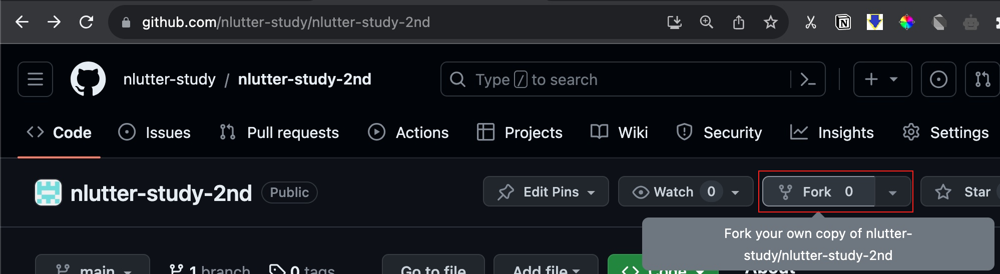

> # NomadfLUTTER study 2nd

Nomad flutter study의 리뷰를 위한 repository 입니다.

## Review guide

### 1. [현재 repository](https://github.com/nlutter-study/nlutter-study-2nd)에서 fork 버튼을 눌러 본인 github 계정 소유의 repository 를 만듭니다.




### 2. 과제를 진행한 project 경로(eg: flutter-study)로 이동하여 review용 repository를 자신소유와 원본 모두 remote 에 각각 추가합니다.

```sh
cd flutter-study
git remote add review-origin https://github.com/{githubId}/nlutter-study-2nd
git remote add review-upstream https://github.com/nlutter-study/nlutter-study-2nd
```

### 3. 과제를 진행한 project 경로(eg: flutter-study) 에서 branch 를 생성합니다.

```sh
# cd flutter-study
git checkout -b day12-movieflix # 과제명예시
```

### 4. review를 위한 commit 을 정리 후, review-upstream/{githubId} 를 rebase 합니다.

#### 4-1. commit 정리

- `flutter create project`와 `과제구현부` 가 하나의 commit 으로 되어있는 경우 [rebase](https://docs.github.com/en/get-started/using-git/about-git-rebase) 를 통해 두 개의 commit 으로 분리해 주시는 것이 리뷰에 용이합니다. 저같은 경우 `lib/*` 를 맨 마지막에 commit하고 그 나머지를 미리 commit해두는 편입니다.
- `flutter create project`와 `과제구현부` commit 분리된 결과물의 예시

```sh
$ git log --name-only

commit 9450412149aba694eda2111b87f0cd9780c94f7a
Author: devgony <devgony@gmail.com>
Date:   Tue Oct 24 23:57:30 2023 +0900

    Day14-Movieflix!

movieflix/lib/main.dart
movieflix/lib/models/movie_detail_model.dart
#...

commit 2eb60d867e493e5307ab968c307d844b8952347c
Author: devgony <devgony@gmail.com>
Date:   Tue Oct 24 16:36:31 2023 +0900

    build: create movieflix project

movieflix/android/.gitignore
movieflix/ios/Flutter/AppFrameworkInfo.plist
movieflix/linux/flutter/CMakeLists.txt
#...
```

#### 4-2. review-upstream/{githubId} 기반으로 PR을 올릴 준비를 합니다.

- githubId 가 존재하지 않는경우 henry 에게 문의 부탁 드립니다.

```sh
# cd flutter-study
git fetch review-upstream {githubId}
git rebase review-upstream/{githubId}
```

### 5. review-origin 에 push 하고 [review-upstream](https://github.com/nlutter-study/nlutter-study-2nd/) 접속하여 PR을 생성합니다.

- 리뷰 대상이 아닌 파일과 commit이 섞여 있는 경우 어떤 Commit부터 리뷰의 대상인지 설명을 작성 해주시면 좋습니다.
- 내용에는 간단하게 해당 PR에 대한 설명과 구현할 목표(Todo)를 작성해주시면 좋습니다.
- 하나의 디렉토리 내에 각 과제 프로젝트가 폴더 로 분리되어있는 monorepo 방식으로 개발 해주시면 추후 리뷰의 편의성을 높일 수 있습니다.

```sh
# cd flutter-study
git push review-origin day12-movieflix
```

- review-origin에 push 직후 [review-upstream](https://github.com/nlutter-study/nlutter-study-2nd/) 에 접속하면 아래와 같은 PR 생성 버튼이 보입니다.


base repository 는 반드시 본인 githubId로 해주셔야 합니다.


